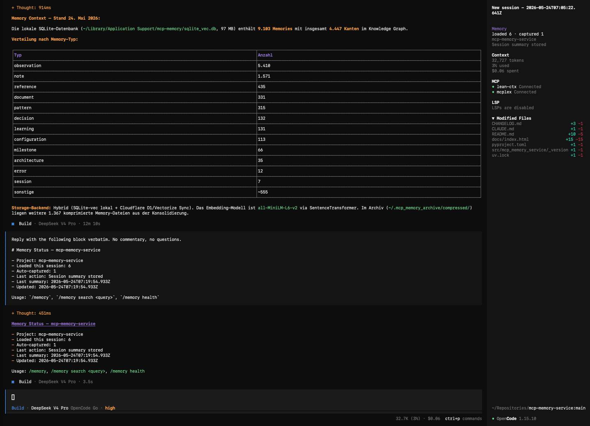

# OpenCode Memory Awareness Plugin
Automatic memory retrieval, context injection, and write-back for OpenCode using the `mcp-memory-service` HTTP API.

This integration provides:

- **Session Start**: load relevant memories when an OpenCode session starts
- **Auto-Capture**: detect and store valuable conversation content (decisions, errors, learnings) in real-time via `message.part.updated`
- **Natural Memory Triggers**: mid-conversation memory retrieval — detects when you ask about stored knowledge (e.g. "what did we decide about X?") and injects relevant memories into the next system prompt
- **Git-Aware Context**: uses recent `git log` commits to generate additional memory search queries, surfacing memories related to active development work
- **Memory Mode Controller**: switch between `speed_focused`, `balanced`, and `memory_aware` profiles via `/memory mode <profile>` or `OPENCODE_MEMORY_MODE` env var
- **Session-End**: consolidate full-session outcomes via `session.idle` (incremental upsert that overwrites the previous summary so the latest state always wins)
- **Harvest**: optional pattern-harvesting via `/api/harvest` at session end
- **Compact Injection**: inject condensed memory context into `experimental.session.compacting`
- **`/memory` Slash Command**: status, search, health, and mode control

## Prerequisites

- OpenCode with plugin support
- `mcp-memory-service` running in HTTP mode

Start the service locally:

```bash
pip install mcp-memory-service
MCP_ALLOW_ANONYMOUS_ACCESS=true memory server --http
```

If you secure the API with `MCP_API_KEY`, set the client-side plugin key explicitly with `memoryService.apiKey` or `OPENCODE_MEMORY_API_KEY`.

`http://127.0.0.1:8000` is only the default fallback. The plugin can target any reachable HTTP deployment of `mcp-memory-service`.

## Install

OpenCode loads local plugins automatically from:
- `~/.config/opencode/plugins/` for global plugins
- `.opencode/plugins/` for project-local plugins

Copy the plugin file to one of those locations:

```bash
git clone https://github.com/doobidoo/mcp-memory-service.git
cd mcp-memory-service
mkdir -p ~/.config/opencode/plugins
cp opencode/memory-plugin.js ~/.config/opencode/plugins/
```

Optional: install the example config as a starting point:

```bash
cp opencode/memory-plugin.config.example.json ~/.config/opencode/memory-plugin.json
```

No `plugin` entry is required in `opencode.json` when loading from the local plugin directory.

## Configuration

The plugin looks for config in this order:
- `options.configPath` when the plugin is loaded programmatically
- `OPENCODE_MEMORY_PLUGIN_CONFIG`
- `~/.config/opencode/memory-plugin.json`
- `~/.config/opencode/memory-awareness.json`
- `.opencode/memory-plugin.json`
- `.opencode/memory-awareness.json`

Then it applies environment overrides:
- `OPENCODE_MEMORY_ENDPOINT` or `OPENCODE_MEMORY_URL`
- `OPENCODE_MEMORY_API_KEY`
- `OPENCODE_MEMORY_TIMEOUT_MS`
- `OPENCODE_MEMORY_LOAD_TIMEOUT_MS`
- `OPENCODE_MEMORY_MODE` — set to `speed_focused`, `balanced`, or `memory_aware`

If you load the plugin with explicit plugin options, those win last.

`MCP_API_KEY` is intentionally not consumed by the plugin. That avoids accidentally reusing the server-side secret from a shared shell environment.

### Full Config Reference

```json
{
  "memoryService": {
    "endpoint": "https://memory.example.com",
    "apiKey": "",
    "maxMemoriesPerSession": 8,
    "searchTags": ["decision"],
    "includeProjectTag": false,
    "projectQueries": [
      "{project} architecture decisions",
      "{project} recent work",
      "{project} open issues"
    ]
  },
  "output": {
    "verbose": true,
    "includeTimestamps": true,
    "maxContentLength": 280
  },
  "autoCapture": {
    "enabled": true,
    "minMessageLength": 100,
    "minSentenceLength": 40,
    "patterns": ["decision", "error", "learning", "implementation", "important"]
  },
  "naturalTriggers": {
    "enabled": true,
    "triggerThreshold": 0.6,
    "cooldownPeriod": 30000,
    "maxMemoriesPerTrigger": 3
  },
  "gitAnalysis": {
    "enabled": true,
    "commitLookback": 14,
    "maxCommits": 20,
    "maxGitMemories": 3
  },
  "mode": {
    "profile": "balanced",
    "profiles": {
      "speed_focused": {
        "maxMemoriesPerSession": 4,
        "loadTimeoutMs": 1000,
        "naturalTriggersEnabled": false,
        "gitAnalysisEnabled": false
      },
      "balanced": {
        "maxMemoriesPerSession": 8,
        "loadTimeoutMs": 2500,
        "naturalTriggersEnabled": true,
        "gitAnalysisEnabled": true
      },
      "memory_aware": {
        "maxMemoriesPerSession": 12,
        "loadTimeoutMs": 5000,
        "naturalTriggersEnabled": true,
        "gitAnalysisEnabled": true
      }
    }
  }
}
```

## How It Works

### Session Start
On `session.created`, the plugin:
- derives the project name from the working directory
- runs semantic searches for project-specific queries
- if git analysis is enabled, extracts recent commit messages as additional queries
- stores the best matches in per-session plugin state

### Natural Memory Triggers (Mid-Conversation)
On `message.part.updated`, the plugin:
- detects memory-seeking queries using pattern matching ("what did we", "remember when", "tell me about", etc.)
- on match, performs an async semantic search for the user's query
- merges new memories with existing session state (deduplicated)
- new memories are injected into subsequent system prompts via `experimental.chat.system.transform`

### Git-Aware Context
Before session load:
- runs `git log --oneline` for the configured lookback period
- extracts meaningful commit messages (filters out merges, WIPs, changelogs)
- uses these messages as additional semantic search queries
- results are merged with project query results

### Memory Mode Controller
The plugin applies profile settings on config load:
- `speed_focused`: 4 memories max, no natural triggers, no git analysis, 1s timeout
- `balanced` (default): 8 memories, both enabled, 2.5s timeout
- `memory_aware`: 12 memories, both enabled, 5s timeout

Profile can be overridden at runtime with `/memory mode <profile>`.

## Slash Command: `/memory`

Register the command in `~/.config/opencode/opencode.json`:

```json
{
  "command": {
    "memory": {
      "description": "Show MCP Memory Service status. Usage: /memory, /memory search <query>, /memory health, /memory mode <profile>",
      "template": ""
    }
  }
}
```

Then in OpenCode:
- `/memory` — current session status (mode, project, loaded count, captured count)
- `/memory search <query>` — top 5 semantic matches for the query
- `/memory health` — backend type, status, total memory count, endpoint
- `/memory mode <profile>` — switch between speed_focused, balanced, memory_aware

The plugin intercepts the command via `command.execute.before`, fetches data from the memory service, and replaces the user message with a formatted block plus a "reply verbatim" instruction. One small LLM round-trip per call. If your default model adds commentary anyway, set `command.memory.model` to a smaller/cheaper model.

## TUI Toasts

The plugin shows transient toasts via `client.tui.showToast` in three situations (rate-limited to once per session):

- on first memory load: `Loaded N memories for <project>`
- on each auto-capture: `Captured <type> memory for <project>`
- on first session summary store: `Storing session summary for <project>`

`variant` must be one of `info | success | warning | error` — omitting it returns 400 from `/tui/show-toast`.

## Status File Bridge

The plugin writes a JSON snapshot to `~/.local/state/opencode/.memory-status.json` on each significant event (load, capture, summary). Override via `OPENCODE_MEMORY_STATUS_FILE`. Schema:

```json
{
  "projectName": "string",
  "loadedCount": 0,
  "capturedCount": 0,
  "lastAction": "string",
  "lastSummaryAt": "ISO timestamp",
  "updatedAt": "ISO timestamp"
}
```

This file is consumed by the TUI sidebar widget (next section) but is also useful for any external tool that wants the latest snapshot of memory activity.

## TUI Sidebar Widget

The repo ships a Solid TUI plugin (`opencode/memory-status-tui.tsx`) that renders a live "Memory" panel in the OpenCode sidebar showing project, loaded count, captured count, and the last action. It polls the status file every 1.5 seconds.

**Install (one-time):**

```bash
# 1. Install babel deps once (used by the build script). They land in
#    ~/.config/opencode/node_modules and are reused by future builds.
cd ~/.config/opencode
bun add @opentui/solid @opentui/core

# 2. Compile and deploy.
node /path/to/mcp-memory-service/opencode/build-tui-plugin.mjs
```

The build script writes the compiled file to `opencode/memory-status-tui.js` and mirrors it to `~/.config/opencode/plugins/memory-status-tui/index.js` (creates `package.json` if missing).

**Register in `~/.config/opencode/tui.json`** (TUI plugins use a separate config file from server plugins):

```json
{
  "$schema": "https://opencode.ai/tui.json",
  "plugin": [
    "file:///Users/<you>/.config/opencode/plugins/memory-status-tui"
  ]
}
```

After restart, the sidebar shows a new "Memory" section above Context, and `/memory` renders a status block in chat:



**Key takeaway for plugin authors:** OpenCode splits config across two files. Server plugins (`{id, server}` exports) go in `opencode.json["plugin"]`. TUI plugins (`{id, tui}` exports) go in `tui.json["plugin"]`. Putting a TUI plugin in `opencode.json` triggers the loader error `must default export an object with server()`.

## Limitations

- depends on the HTTP API being reachable
- relevance is intentionally simple and project-name driven in the first cut
- auto-capture uses regex-based pattern detection (no LLM-based classification)
- session-end consolidation may overlap with auto-capture entries (both write to `/api/memories`)
- natural triggers use pattern matching, not semantic understanding — may miss or false-trigger on complex queries
